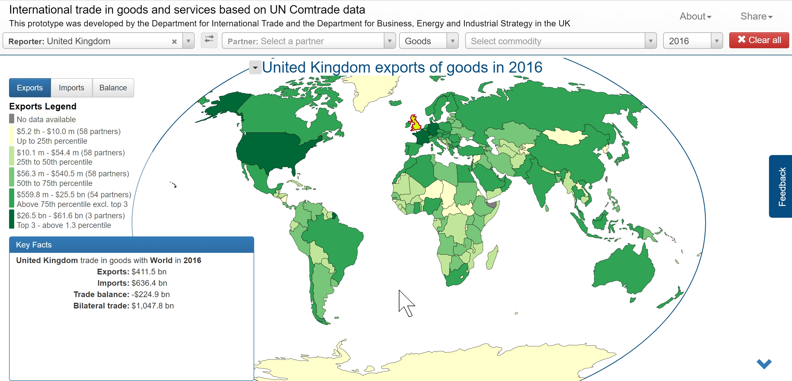

# Trade Map Visualization



This repository holds the source code for two similar data visualizations:

- [International trade in goods and services based on UN Comtrade data](https://comtrade.un.org/labs/dit-trade-vis)<br />
Commissioned by the Department for International Trade (DIT UK) in 2015.<br />
See [`src/comtrade/README.md`](src/comtrade/README.md) for more details.
- UK Internationational trade in goods based on HMRC data<br />
Commissioned by the Northern Ireland Statistics and Research Agency (NISRA) in 2018.<br />
See [`src/nisra/README.md`](src/nisra/README.md) for more details.

The visualizations are closely related and share some code so they are in a shared project. The code is licenced under the [GPL-3.0 licence](LICENCE.txt).

## Installing and running

Building and development require Git, NodeJS and NPM. See [nodejs.org](https://nodejs.org/) for installation instructions.

Clone this repository:

```
git clone git@github.com:mjs2020/trademap.git
cd trademap
```

Install dependencies

```
npm install
```

To serve the project locally in development mode:

```
npm run start:comtrade
# or
npm run start:nisra
```

The server runs on port 9000 so you can then open http://localhost:9000

To build the projects for development:

```
npm run build:comtrade
# or
npm run build:nisra
```

See [`src/comtrade/README.md`](src/comtrade/README.md) or [`src/nisra/README.md`](src/nisra/README.md) for more details.

## Credits

Coding by [Francesco Merletti](http://fm.to.it).

Contacts:

* Email: [me@fm.to.it](mailto:me@fm.to.it)
* Twitter: [@mjs2020](http://fm.to.it/tw)
* Github: [@mjs2020](http://fm.to.it/gh)


## Libraries, frameworks and tools used in the project

Frontend:

* [Bootstrap](https://getbootstrap.com/): General look, UI, responsiveness
* [D3js](https://d3js.org/): Graphing and map
* [Topojson](https://github.com/mbostock/topojson/wiki): For loading and processing map data.
* [d3-geo-projection](https://github.com/mbostock/d3/wiki/Geo-Projections): For drawing the map
* [Crossfilter](https://github.com/square/crossfilter): Used as an in-browser database
* [jQuery](https://jquery.com/): UI management
* [Modernizr](https://modernizr.com/): For checking feature support in browsers
* [select2](https://select2.github.io/): For the drop-down select controls
* [file-saver-saveas-js](https://github.com/eligrey/FileSaver.js/): For saving SVG and PNGs
* [d3-tip](https://github.com/Caged/d3-tip)
* [intro.js](https://github.com/usablica/intro.js/#attributes)

Development tools:

* [Webpack](https://webpack.js.org/): To bundle the project

